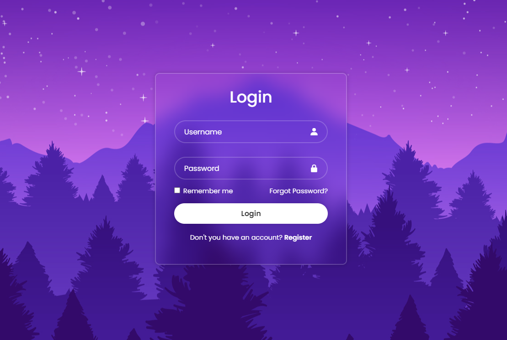
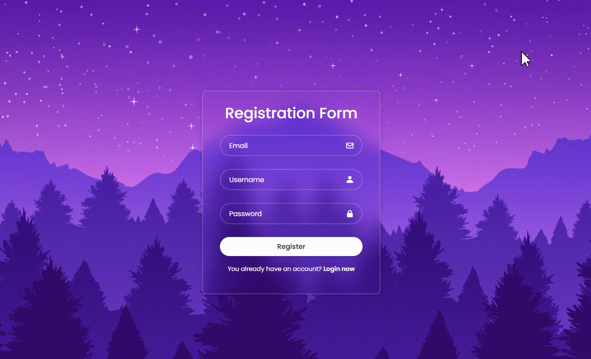
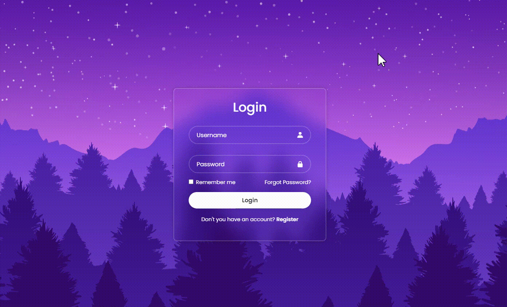

# Login and Register Spring Security Demo

  

Framework: Spring Boot 3.2.3

Package manager: Maven

Dependencies: 
- Thymeleaf
- Spring Web 
- Spring Security
- Spring Data JPA & Hibernate
- PostgreSQL Driver
- ModelMapper

## Description

This web application is built using Spring Boot, Thymeleaf, PostgreSQL, and Spring Security to provide secure user authentication, 
registration, and role-based access control. It allows users to register, log in, and access different parts of the application based on their 
assigned roles: user or admin. PostgreSQL is used as the database management system to store user information and roles.

### Features:

1. **User Registration**: New users can register by providing a username, email, password, and selecting a role (user or admin).
2. **User Login**: Registered users can securely log in using their credentials.
3. **Role-Based Access Control**: Two roles are defined: user and admin. Each role has access to specific functionalities and resources within the application.
4. **Thymeleaf Templates**: Thymeleaf is used for server-side rendering of web pages, providing a seamless user experience.
5. **Secure Password Storage**: Passwords are securely hashed and stored in the database using industry-standard encryption techniques (BCrypt).
6. **Session Management**: Spring Security manages user sessions to ensure security and prevent unauthorized access.
7. **Error Handling**: Custom error pages and messages are implemented to handle various scenarios gracefully.
8. **Database Integration**: PostgreSQL is used as the backend database to store user credentials and roles securely.

## User Registration:

## Admin Account Management:

## Conclusion:

This Spring Boot application provides a secure and user-friendly login and registration system with role-based access control. 
By integrating Spring Security, Thymeleaf, and PostgreSQL, it offers robust authentication, authorization, and data storage capabilities, 
making it suitable for various web applications requiring user management functionalities.

